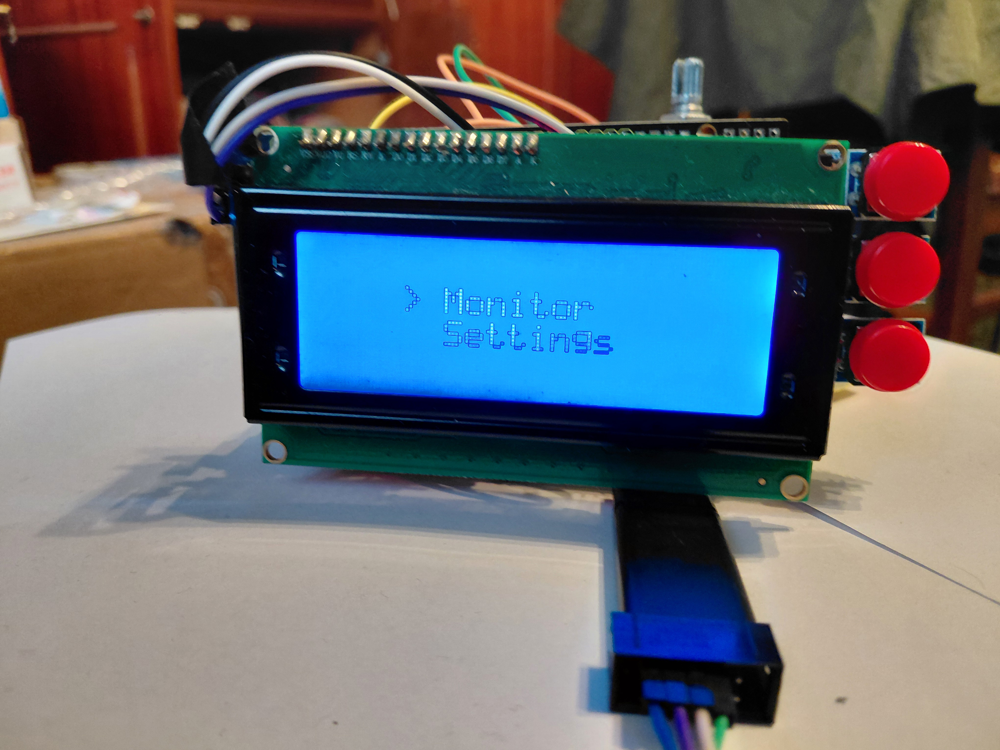
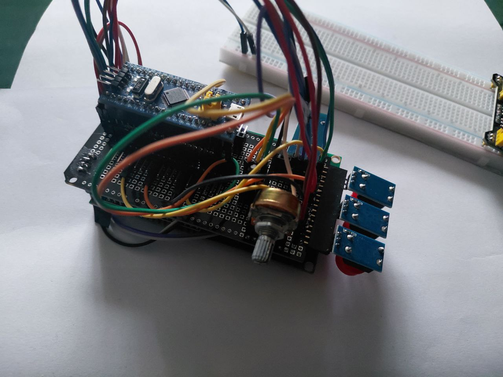
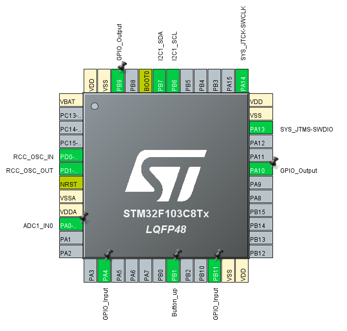

## Demo

Click the link below to watch the project in action:

👉 https://github.com/job-space/Visor/videos/demo.mp4


# Temperature Monitoring System Using DS18B20 and LCD2004 with STM32

This project demonstrates a temperature monitoring system based on an STM32 microcontroller, using a DS18B20 digital temperature sensor and an LCD2004 display. The system allows real-time temperature monitoring, threshold configuration, and audible alerting.

---

## 📜 Table of Contents
- [Introduction](#introduction)
- [Features](#features)
- [Hardware Components](#hardware-components)
- [Circuit Diagram](#circuit-diagram)
- [Software Description](#software-description)
- [Getting Started](#getting-started)
- [Future Improvements](#future-improvements)
- [License](#license)

---

## 📝 Introduction

The goal of this project is to measure ambient temperature using the DS18B20 sensor and display the result on an LCD2004 screen. The system includes a simple menu for configuration and provides a sound alert when the temperature exceeds a user-defined threshold.

---

## 🌟 Features

- **Temperature Measurement**: Reads temperature data from the DS18B20 sensor (OneWire protocol).
- **LCD Display**: Displays current temperature and system status on an LCD2004.
- **Threshold Configuration**: Adjustable temperature limit using buttons.
- **Audible Alert**: Activates a buzzer when the temperature exceeds the set threshold.
- **Non-Volatile Storage:**: Saves threshold settings in Flash/EEPROM.
- **Real-Time Operation**: Continuous temperature monitoring without blocking delays.
  
---

## 🛠 Hardware Components

- STM32 Microcontroller (e.g. STM32F1)
- DS18B20 Digital Temperature Sensor
- LCD2004 (I2C interface)
- Push Buttons
- Buzzer
- Potentiometer
- Jumper Wires

---

## 💻 Software Description

The project is developed using STM32CubeIDE and HAL libraries.
1. DS18B20 Driver:
   - Communicates via OneWire protocol.
   - Converts raw sensor data to temperature in Celsius.
2. LCD2004 Driver:
   - Uses I2C interface for communication.
   - Displays temperature values and menu options.
3. Menu System:
   - Allows navigation and configuration using buttons.
   - Supports threshold value adjustment.
4. Main Loop:
   - Periodically reads temperature data.
   - Updates LCD display.
   - Triggers buzzer when threshold is exceeded.

### Dependencies:
- STM32 HAL library
- STM32CubeIDE version 1.17.0 or later

---

 ## Developers
 
[y.kovalchuk](https://github.com/job-space)

## License

Project Visor is distributed under the MIT lisense.

## 🚀 Getting Started

### 1. Clone the repository:
```bash
git clone https://github.com/your-username/stm32-temperature-monitor.git
